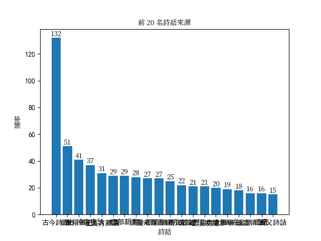
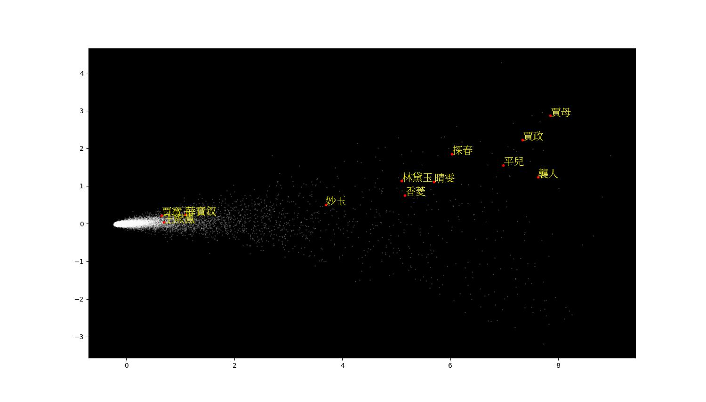
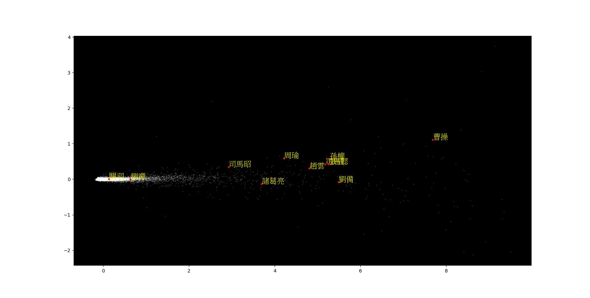
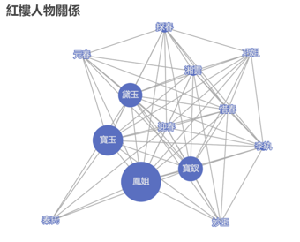
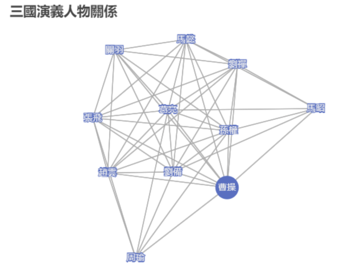

# 用自然語言處理文言文中人物關係之研究

## 專案概述

這個專案是我第一個「資料視覺化與分析」相關的專案，旨在使用資料分析和自然語言處理技術，分析文言文的人物關係。  
會將分析材料鎖定於文言文，係由於我本身畢業於中國文學系所，除了文本的研讀與探究，研究所期間也有修習「數位人文」課程，對運用數位媒材協助議題的開展，甚感新鮮與有趣。因此，想藉由這次的程式操作，更進一步理解資料分析的程式開發，以及運用程式進行資料分析與傳統的研究方法，兩者的探究結果之異同。

### 分析資料

#### 1. 《詩話總龜》前集  
[《詩話總龜》前集](https://ctext.org/wiki.pl?if=gb&res=459126) 是宋人阮閱所編之宋代著名的詩話總集，蒐羅宋代詩話、隨筆等詩歌評論的書籍。期望可以藉由資料分析方法，得知書中引用內容和蒐羅資料的出處來源。

#### 2. 《紅樓夢》和《三國演義》  
[《紅樓夢》](https://ctext.org/hongloumeng/zh) 和[《三國演義》](https://ctext.org/sanguo-yanyi/zh) 這兩本是中國古代著名的章回小說。尤其是《紅樓夢》，更是最為著名且研究議題為古今中外討論度最高的，甚至將研究《紅樓夢》相關議題的學問，稱為「紅學」，其重要程度可見一斑。然而，也正因為《紅樓夢》‵備受高度關注，現有的資料分析，亦多如過江之鯽；因此，另外再加上也是為大眾所熟知的《三國演義》，以同樣方法進行分析、再次演練。

### 分析方法
+ 使用 [Jieba 分詞模組](https://github.com/fxsjy/jieba/tree/master) 進行文本分詞。
+ 使用詞頻分析模組進行詞頻統計。
+ 使用 [matplotlib 技術](https://zh.wikipedia.org/zh-tw/Matplotlib) 生成文字雲和長條圖以視覺化詞頻分佈。
+ 使用 [Word2Vec 模型](https://zh.wikipedia.org/zh-tw/Word2vec) 進行詞向量表示和相似度計算。
+ 使用 [Social network 技術](https://zh.wikipedia.org/zh-tw/%E7%A4%BE%E4%BC%9A%E7%BD%91%E7%BB%9C) 生成人際網絡圖。

## 安裝說明

1. Clone 這個專案到 local  
    ```bash
    git clone https://github.com/liaoxiaoxuan/infinite_class_analyze.git
    ```

2. 安裝相關資源
    ```
        pip install -r requirements.txt  
    ```

## 使用方式

### 1. 《詩話總龜》前集引用詩話分析

#### 1-1. 安裝相關模組：  
```
    pip install numpy
    pip install pillow
    pip install jieba
    pip install matplotlib
    pip install wordcloud
```

#### 1-2. 下載相關資源
+ 下載繁體中文詞庫檔案 [dict.txt.big.txt](src/dict.txt.big.txt)
+ 下載中文字型檔案 [NotoSerifTC-Regular.otf](Noto_Serif_TC/NotoSerifTC-Regular.otf)

#### 1-3. 執行程式碼
```
    python src/txt_author_jieba.py
```

### 2. 《紅樓夢》和《三國演義》詞向量表示和相似度計算

#### 2-1. 安裝相關模組：  
```
    pip install numpy
    pip install pillow
    pip install jieba
    pip install matplotlib
    pip install gensim
    pip install scikit-learns
```

#### 2-2. 下載相關資源
+ 下載繁體中文詞庫檔案 [dict.txt.big.txt](src/dict.txt.big.txt)
+ 下載中文字型檔案 [NotoSerifTC-Regular.otf](Noto_Serif_TC/NotoSerifTC-Regular.otf)
+ 下載文本檔案
    - 《紅樓夢》 [hongloumeng.txt](src/hongloumeng.txt)  
    - 《三國演義》 [Sanguoyanyi.txt](src/Sanguoyanyi.txt)
+ 下載人名和地名字典檔案
    - 《紅樓夢》 [Hongxue_character.txt](src/Hongxue_character.txt) 和 [Hongxue_place.txt](src/Hongxue_place.txt)
    - 《三國演義》 [Sanguoyanyi_character.txt](src/Sanguoyanyi_character.txt) 和 [Sanguoyanyi_place.txt](src/Sanguoyanyi_place.txt)

#### 2-3. 執行程式碼
+ 《紅樓夢》
    ```
        python src/Hongxue_word2vec.py
    ```
+ 《三國演義》
    ```
        python src/Sanguoyanyi_word2vec.py
    ```

### 3. 《紅樓夢》和《三國演義》人際網絡圖

#### 3-1. 安裝相關模組：  
```
    pip install pandas
    pip install pyecharts
    pip install jieba
    pip install snapshot-selenium
```

#### 3-2. 下載相關資源
+ 下載繁體中文詞庫檔案 [dict.txt.big.txt](src/dict.txt.big.txt)
+ 下載中文字型檔案 [NotoSerifTC-Regular.otf](Noto_Serif_TC/NotoSerifTC-Regular.otf)
+ 下載文本檔案
    - 《紅樓夢》 [hongloumeng.txt](src/hongloumeng.txt)  
    - 《三國演義》 [Sanguoyanyi.txt](src/Sanguoyanyi.txt)
+ 下載人名字典
    - 《紅樓夢》 [Hongxue_renwu_forcut.txt](src/Hongxue_renwu_forcut.txt)
    - 《三國演義》 [Sanguoyanyi_renwu_forcut.txt](src/Sanguoyanyi_renwu_forcut.txt)

#### 3-3. 執行程式碼
+ 《紅樓夢》
    ```
        python src/Hongxue_networks.py
    ```
+ 《三國演義》
    ```
        python src/Sanguoyanyi_networks.py
    ```

## 程式架構與結果呈現

1. 《詩話總龜》前集引用詩話分析  
    分析《詩話總龜》前集引用的詩話次數和頻率，生成文字雲和長條圖。  
    + 文字雲
      
    
    + 長條圖  
      

2. 《紅樓夢》和《三國演義》詞向量表示和相似度計算：**Word2Vec**  應用  

    **2-1. 《紅樓夢》**  
        匯入人名和地名字典之後，將《紅樓夢》進行斷詞，接著繪製 Word2Vec 二維空間投影，並計算書中賈寶玉和十二金釵等主要人物之間的距離相似度。  
    
    + 二維空間投影
    

    + 詞向量表示  
        ```
        賈惜春 和 秦可卿 之間的距離為: 0.09717483818531036
        賈元春 和 賈迎春 之間的距離為: 0.12379106134176254
        賈元春 和 秦可卿 之間的距離為: 0.1463087499141693
        賈迎春 和 秦可卿 之間的距離為: 0.15767629444599152
        賈元春 和 賈惜春 之間的距離為: 0.17363978922367096
        賈迎春 和 賈惜春 之間的距離為: 0.1937878131866455
        賈寶玉 和 王熙鳳 之間的距離為: 0.31754785776138306
        賈寶玉 和 薛寶釵 之間的距離為: 0.32167917490005493
        薛寶釵 和 王熙鳳 之間的距離為: 0.4114401638507843
        史湘雲 和 巧姐 之間的距離為: 0.6686884760856628
        ```
    
    + 餘弦相似度  
        ```
        林黛玉 和 賈惜春 之間的 cosine similarity 為: 0.6387871503829956
        史湘雲 和 賈惜春 之間的 cosine similarity 為: 0.6321501731872559
        妙玉 和 賈惜春 之間的 cosine similarity 為: 0.6299555897712708
        賈惜春 和 巧姐 之間的 cosine similarity 為: 0.5755219459533691
        賈元春 和 賈惜春 之間的 cosine similarity 為: 0.5324227213859558
        賈寶玉 和 賈惜春 之間的 cosine similarity 為: 0.5182535648345947
        薛寶釵 和 賈惜春 之間的 cosine similarity 為: 0.49956437945365906
        賈惜春 和 王熙鳳 之間的 cosine similarity 為: 0.47346630692481995
        賈惜春 和 秦可卿 之間的 cosine similarity 為: 0.46621453762054443
        賈迎春 和 賈惜春 之間的 cosine similarity 為: 0.3522908091545105
        ```  

    **2-2. 《三國演義》**  
        匯入人名和地名字典之後，將《三國演義》進行斷詞，接著繪製 Word2Vec 二維空間投影，並計算書中諸葛亮和三國主要人物之間的距離相似度。  
    
    + 二維空間投影
    
    
    + 詞向量表示  
        ```
        孫權 和 司馬懿 之間的距離為: 0.2548621892929077  
        張飛 和 司馬懿 之間的距離為: 0.27175915241241455  
        張飛 和 孫權 之間的距離為: 0.3394671082496643  
        趙雲 和 司馬懿 之間的距離為: 0.4629286527633667  
        張飛 和 趙雲 之間的距離為: 0.47713392972946167  
        關羽 和 劉禪 之間的距離為: 0.5029202699661255  
        劉備 和 張飛 之間的距離為: 0.5201414823532104  
        孫權 和 趙雲 之間的距離為: 0.5865809321403503  
        劉備 和 司馬懿 之間的距離為: 0.6148875951766968  
        劉備 和 孫權 之間的距離為: 0.6972569823265076
        ```  
    
    + 餘弦相似度  
        ```
        諸葛亮 和 關羽 之間的 cosine similarity 為: 0.9739437103271484
        關羽 和 趙雲 之間的 cosine similarity 為: 0.9715537428855896
        劉備 和 關羽 之間的 cosine similarity 為: 0.9709815382957458
        關羽 和 張飛 之間的 cosine similarity 為: 0.9692081809043884
        關羽 和 司馬昭 之間的 cosine similarity 為: 0.9681985378265381
        關羽 和 司馬懿 之間的 cosine similarity 為: 0.9670453071594238
        關羽 和 劉禪 之間的 cosine similarity 為: 0.966686487197876
        關羽 和 孫權 之間的 cosine similarity 為: 0.9662905335426331
        關羽 和 周瑜 之間的 cosine similarity 為: 0.9635964035987854
        關羽 和 曹操 之間的 cosine similarity 為: 0.955909252166748
        ```  

3. 《紅樓夢》和《三國演義》人際網絡圖：**Social networks** 應用  

    **3-1. 《紅樓夢》**  
        匯入人名和地名字典之後，將《紅樓夢》進行斷詞，並生成書中賈寶玉和十二金釵等主要人物之間的人際網絡圖。  
          
     
    
    **2-2. 《三國演義》**  
        匯入人名和地名字典之後，將《三國演義》進行斷詞，並生成書中諸葛亮和三國主要人物之間的人際網絡圖。  
        
        
    
## 其他參考資源

1. word2vect 相關  

    + 用詞向量技術簡單分析紅樓夢人物關係用 n-gramma 生成詞向量 word2vect 進行模型訓練   
    https://cloud.tencent.com/developer/article/1180991  
    
    + 用深度學習模型 Word2Vec 探索《紅樓夢》人物關係  
    https://www.cnblogs.com/wangliman/p/9740302.html  

    + python 紅樓夢人物關係網絡圖
    https://blog.51cto.com/u_16099267/8985550

2. Social networks 相關

    + Python分析紅樓夢社交網路  
    https://zhuanlan.zhihu.com/p/78845119

    + Python分析紅樓夢，寶玉和十二釵的人物關係  
    https://mp.weixin.qq.com/s?__biz=MzI3NDk3MDgxMA==&mid=2247484472&idx=1&sn=b7093962a9d0b621abe80e0d85798c4c&scene=19#wechat_redirect

    + 用python分析《三國演義》中的社交網路  
    https://github.com/blmoistawinde/hello_world/blob/master/sanguo_network/%E7%94%A8python%E5%88%86%E6%9E%90%E3%80%8A%E4%B8%89%E5%9B%BD%E6%BC%94%E4%B9%89%E3%80%8B%E4%B8%AD%E7%9A%84%E7%A4%BE%E4%BA%A4%E7%BD%91%E7%BB%9C.md

## 成果與展望

1. Jieba 對文言文的貢獻與限制  
    以現在的分詞工具而言，尚無法對古典散文，進行非常精確地分析，可能需要較多的「字典」輔佐，以提升準確度。  
    
    + 困境  
        原來的「詩話」議題，囿於Jieba對資料的分詞結果，一直不盡人意，也因此無法進行其他更為擴展的分析和解讀。如《詩話總龜》提及的作家和詩歌作品，以及分析與歸納不同援引資料來源，對不同作家或作品的評論。而中國古典章回小說，有著完整的結構、密切且明確的人物互動，再加上用字遣詞也較接近現代的白話書寫，因此才將分析資料改為章回小說。  

    + 後續修正與相關貢獻

        - 需要再輸入更多「字典」，增加分析的準確度。  
        - 這些分詞工具可以分析文言文，倘若分析資料換成白話文，應有更多元的價值與運用。  

2. 古人稱呼的多樣性  
    古人除了姓、名以外，還有各種字、號等稱呼，而古典文學作品，無論是散文或小說，當中的人物稱呼，常常會因時因地，或因交談的對象和往來的親疏等關係而有所不同。  

    + 困境  
        在這份分析中，無論是 work2vect 或 Social networks，為了便利性，皆統一採用人物姓名進行分析，此舉也會影響分析結果。  

    + 後續修正與相關貢獻

        - 需要將人物的所有稱呼都匯入字典，進行分析。  
        - 可以再進一步探討，同一個人物，不同稱謂出現的時刻，進而統整出古人這些多元稱謂的稱呼時機。  

3. 運用程式進行資料分析與傳統的研究方法之異同

    + 參考資料來源  
    撰寫程式的時候，除了參考網路上諸多網誌的作品以外，也會借用 ChatGPT 的力量，完成和理解這些程式；然而，這些作品，尤其是 ChatGPT，都需要再經過驗證與考據，才能判斷這些作法是否可行、資料是否可信。而傳統研究上，縱使有網路檢索，但資料來源是在查找的過程，就會由作者、作者擅長領域、出版社等方面，進行篩選。

    + 資料運用方式  
    在文史領域的傳統研究，比較傾向質性研究，透過文本的解讀、前人的研究成果和時代背景的理解等交互參照，以印證假說。而程式的加入，透過模型的計算，以及圖表的呈現，進一步讓研究成果更加具體。甚至藉由數位工具的協助，讓研究當中需要量化的數據與資料的結果，大幅的增加便利性。